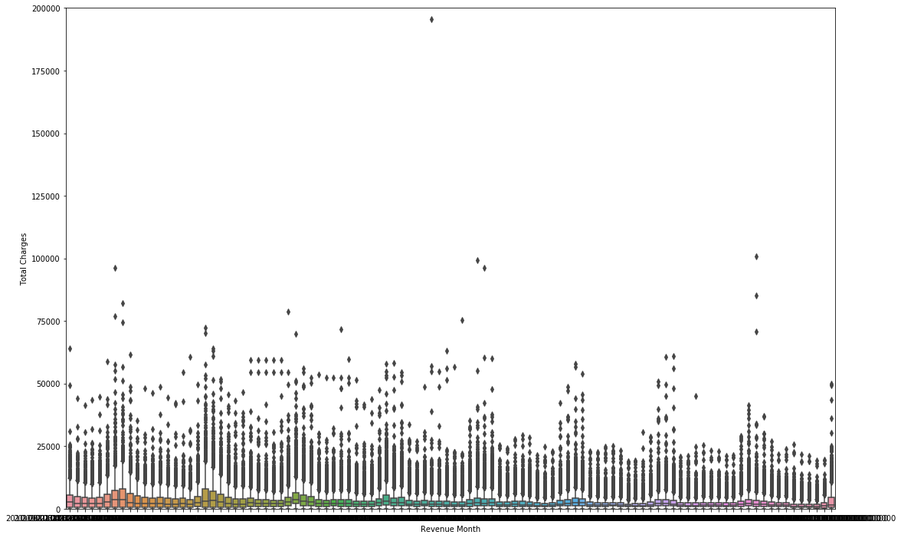

## Data Pipeline Presentation

*We have not been able to evaluate the actual data we will be working with since our sponsor is working on anonymizing the datasets. However, we have been working with the public version of electricity consumption data from New York City Housing Authority (NYCHA) which will be similar in format to the actual data.

### Describe and quantify the available data

The raw data file from NYCHA includes monthly electricity consumption and cost data for buildings in New York City from January 2010 to June 2018. The complete dataset has 313,147 rows and 27 columns. 

There are 13 variables used to identify building information:

| Column Name      | Description                                                                                                                                                                                                                                                                                                      | Expected Values                                                                                                                                |
|------------------|------------------------------------------------------------------------------------------------------------------------------------------------------------------------------------------------------------------------------------------------------------------------------------------------------------------|------------------------------------------------------------------------------------------------------------------------------------------------|
| Development Name | Development name                                                                                                                                                                                                                                                                                                 | The name of the housing development as listed in the Development Data Book.                                                                    |
| Borough          | Borough                                                                                                                                                                                                                                                                                                          | Bronx, Brooklyn, Manhattan, Queens, or Staten Island.                                                                                          |
| Account Name     | Account Name of the building                                                                                                                                                                                                                                                                                     | The name of the account.                                                                                                                       |
| Location         | Building number. In order to run an analysis by building, you can use a combination of TDS and building number which gives a unique identifier for each building                                                                                                                                                 | The building number of the meter                                                                                                               |
| Meter AMR        | Is the meter Automatic Meter Reading (AMR), Interval or none                                                                                                                                                                                                                                                     | AMR, Interval, None                                                                                                                            |
| Meter Scope      | The buildings or areas the account and meter supply                                                                                                                                                                                                                                                              | Listing of the buildings/Areas                                                                                                                 |
| TDS #            | TDS (Tenant Data System) number is the unique identifier for all NCYHA developments. It is recommended to use it in order to run analysis by development. The TDS is also the unique link between NYCHA data sets.                                                                                               | Number.The non development facilities (as identified in the field Funding Source) don't have a TDS #. For these facilities use EDP or RC Code. |
| EDP              | NYCHA Electronic Data Processing. Number used to identify individual NYCHA developments. EDP is used by NYCHA only to link data issued from a different system (the energy management system that was used by NYCHA before 2010). It is recommended to use the TDS # as a unique identifier of each development. | Three digit number                                                                                                                             |
| RC Code          | NYCHA budget responsibility code.  Code representing a specific development.                                                                                                                                                                                                                                     | Letter indicating the borough and series of numbers.                                                                                           |
| Funding Source   | The development’s funding source including Federal,Mixed Finance, or an indication that the facility is a non development facility which means a non residential facility.                                                                                                                                       | Federal, Mixed Finance, or Non Development Facility                                                                                            |
| AMP number       | Abbreviation for Asset Management Project (AMP) numbers.  HUD Development asset tracking number.  An AMP number can consist of more than one development.                                                                                                                                                        | NY and a series of numbers                                                                                                                     |
| Vendor Name      | Utility vendor name                                                                                                                                                                                                                                                                                              | Vendor name                                                                                                                                    |
| Meter Number     | Meter number                                                                                                                                                                                                                                                                                                     | Meter number                                                                                                                                   |

There are 8 variables used to identify individual billing information:

| Column Name        | Description                                                                                                                                | Expected Values        |
|--------------------|--------------------------------------------------------------------------------------------------------------------------------------------|------------------------|
| UMIS Bill ID       | Number associated with the bill                                                                                                            | 7 digits bill id       |
| Revenue Month      | Year and month of bill: 2016-01                                                                                                            | 2016-01                |
| Service Start Date | Bill start date                                                                                                                            | Date                   |
| Service End Date   | Bill end date                                                                                                                              | Date                   |
| number days        | Number of days on bill                                                                                                                     | Number of days on bill |
| Estimated          | Meter was not read for the time period. The consumption and cost are estimated. (Data is updated with actual reads once the meter is read) | Yes (Y)  or No (N)     |
| Rate Class         | The rate applied to the account.  Details about each rate (dollar value) are available on the vendor web site.                             | Rate code is listed.   |
| Bill Analyzed      | The bill was analyzed for billing errors by NYCHA's Utility Management system during the billing period                                    | Yes (Y)  or No (N)     |

There are 6 variables used to identify energy consumption and cost information:

| Column Name       | Description           | Expected Values |
|-------------------|-----------------------|-----------------|
| Current Charges   | Total costs           | Dollar value    |
| Consumption (KWH) | Total KWH consumption | KWH consumption |
| KWH Charges       | Total KWH charges     | Dollar value    |
| Consumption (KW)  | Total KW consumption  | KW consumption  |
| KW Charges        | Total KW charges      | Dollar value    |
| Other Charges     | Total other charges   | Dollar value    |o

### Address issues with the incoming data

There are two levels of granularities regarding the business entities that we want to study - building level and account level. Each account is represeted by a unique meter number in the dataset and each building contains at least one meter. Our goal is to detect anomalous energy consumptions and charges over the years at both the building level and account (meter) level. The metrics of interest for anomaly detection will be monthly Total Charge (sum of KWH Charge and KW Charge) and Total Energy Rate (Total Charge divided by KWH Consumptions). In order to create the aggregated metrics, we first checked the quality of the data to ensure it aligns with our understanding of the data entry rules: 

1. KWH and KW charges and consumptions should be both positive for all entries.
2. Sum of KWH Charges, KW Charges and Other Charges should equal the value of Current Charges

Besides those rules, our sponsor Linnea Paton from JLL pointed out some edge cases that we should be aware of and able to identify from the dataset:

1. For one meter account there might be overlaps or gaps between billing windows. Any overlapping or any gap longer than 5 days should be detected.
2. Under the same building, the meter numbers may change over the years. Therefore the related meter numbers should be merged.

Following are the steps we took to explore and clean the data:

* Scaling, missing value imputation, erroneous data point:

1. General Data Cleaning

First, we cleaned the raw data to exclude rows with null account name, duplicated values and estimated electricity charges since they will not have accurate predictive value for our model.

Secondly, we cleaned data types of variables regarding electricity consumption and charges from string to float. These variables will be our main metrics to draw statistical conclusions and detect energy consumption anomalies from.

Lastly, we converted the time-related variables such as revenue_month, service_start_date and service_end_date to datetime type in python for processing and analysis. We will base off these variables to detect overlaps and gaps in billing windows.

2. Create Unique identifier

Based on the metadata info of the NYCHA public dataset, we used the combination of 'TDS#' and 'Location' to create 'Building ID' as the unique identifier for each building. However, 'Building ID' alone is still not the primary key for each data entry, we are able to uniquely identify over 99.8% of the data entries by combining 'Building ID', 'Meter Number' and 'Revenue Month'. This aligns well with our understanding of the data granularities (2 levels). The remaining 0.2% of the entries are caused by rebilling (two entries for the same billing window of the same meter) and invalid entries where all values associated with consumption and charges are zero.

3. Check validity of data entry logics
   
We found the percentages of rows with zero values in our metrics of interest were surprisingly high:

    - perc of rows - current charges of zero: 16.61%
    - perc of rows - kw charges of zero: 41.13%
    - perc of rows - kwh charges of zero: 33.03%

When aggregating the metrics based on meter numbers, it seems that some meters only record either the KWH charges or the KW charges. Following is a break-down of meters by type: 

    - perc of kw_only meters: 27.66%
    - perc of kwh_only meters: 38.20%
    - perc of kwh_and_kw meters: 34.13%
  
52.79% of the buildings have both kw_only and kwh_only meters. For these buildings, we might need to merge some of their meters so that both kw and kwh charges are represented in the same meter account.

By deep-diving into the data, we found there are many cases where under the same Building_ID, two meter numbers share the same last 6 digits and billing windows of all the years. Usually one meter has zero values in all KW_Charges and one has zero values in all KWH_Charges. It seems reasonable to combined them.

Furthermore, by comparing the billing months, we noticed around 13% of the meters have been replaced by newer meters over the year under the same building. Combining them further reduced the number of meters of invalid types.

In the end, our statistics improved as follows:

    - perc of rows - current charges of zero: 4.17%
    - perc of rows - kw charges of zero: 19.90%
    - perc of rows - kwh charges of zero: 8.47%

    - perc of kw_only meters: 2.16%
    - perc of kwh_only meters: 20.62%
    - perc of kwh_and_kw meters: 77.23%

The percentage of meters that do not have KW Charges is still quite high (21%), we need to further consult with our domain knowledge expert to figure out how to handle that. All other metrics appear resonable.

4. Address Service Date inconsistency

Since the meter reading is done manually in many buildings in New York, the meter reading dates (service start date and service end date) are not consistent across all entries. However, the service dates can be used to detect both overlaps and gaps between billing windows. As it turns out, 40% of the time a meter has gaps longer than 5 days in a year and 1.27% of the meters have overlaps in their billing windows. Again we need to discuss with our sponsor for handling these cases.

5. Add new calculated metrics

After all the above data cleaning steps and with all the caveats of the edge cases, we aggregated the data to the two target levels:

- Building_ID + Revenue_Month
- Buildling_ID + Meter_Number + Revenue_Month

Per suggestion of our sponsor and domain knowledge expert Linnea Paton, we added two calculated fields for our predicative model.

'Total Charges' is calculated by adding 'KW Charges' to 'KWH Charges', this field will provide a more comprehensive trend of total consumption cost.

'Total Energy Rate' is calculated by dividing 'Total Charges' by 'Consumption (KWH)', this field is the industry standard measure for evaluating consumption efficiency.

* Challenges in data pipeline creation:

Currently, the data files we are working with come from flat files provided by our sponsor. Therefore, we are ingesting stdata into Jupyter Notebook for processing and creating rules for anomaly detection.

In the long term, we are planning on deploying rules in our sponsor's SQL database to detect consumption and charges anomalies automatically with new data coming in on a monthly basis.

### Provide some additional insight to the data in the form of statistical or graphical analysis

For the analysis below, we will be using the cleaned version of data where we added columns for unique identifier and calculated fields for total charges and total energy rate. 

The cleaned version of data has 185,900 rows and 16 columns. Column variables are listed below:

| Variable Name      | Variable type |
|--------------------|---------------|
| Account Name       | string        |
| Location           | string        |
| Building ID        | string        |
| Meter Number       | string        |
| Revenue Month      | datetime64    |
| Service Start Date | datetime64    |
| Service End Date   | datetime64    |
| # days             | float         |
| Consumption (KW)   | float         |
| Consumption (KWH)  | float         |
| Current Charges    | float         |
| KW Charges         | float         |
| KWH Charges        | float         |
| Other charges      | float         |
| Total Charges      | float         |
| Total Energy Rate  | float         |

We first generated distribution statistics on all the numeric fields:

|       | Consumption (KW) | Consumption (KWH) | Current Charges | KWH Charges   | KW Charges   | Other charges | Total Charges | Total Energy Rate |
|-------|------------------|-------------------|-----------------|---------------|--------------|---------------|---------------|-------------------|
| count | 252554           | 252554            | 252554          | 252554        | 252554       | 252554        | 252554        | 252554            |
| mean  | 68.472229        | 33058.35          | 4568.972260     | 1698.409516   | 1088.141845  | 1699.030754   | 2786.551361   | inf               |
| std   | 121.695395       | 53707.28          | 6722.453061     | 2958.148067   | 1783.039027  | 3667.192281   | 3614.090060   | NaN               |
| min   | 0.000000         | 0.000000          | -243.150000     | 0.000000      | 0.000000     | -59396.430000 | 0.000000      | 0.000000          |
| 25%   | 0.000000         | 0.000000          | 421.240000      | 0.000000      | 0.000000     | 0.000000      | 825.390000    | 0.05486036        |
| 50%   | 32.400000        | 12160             | 2555.780000     | 594.000000    | 462.940000   | 910.270000    | 1722.690000   | 0.08328255        |
| 75%   | 99.200000        | 48800             | 6120.545000     | 2385.070000   | 1603.822500  | 2659.952500   | 3270.170000   | inf               |
| max   | 16135.460000     | 1779600           | 329800.370000   | 195575.860000 | 78782.960000 | 134224.510000 | 195575.860000 | inf               | 

From the statistics, we can see that more than 25% of the consumption (KWH) values are 0, which caused values in Total Energy Rate to be infinite and invalid for further evaluation. However, from the 50% quartile, we can get a sense of the valid energy rate range. We are also able to detect range from 50% quartile for other measures for consumption and charges, especially the fact that other charges have large range for positive and negative values. This will later be useful for setting criteria for anomaly detection.

We also explored potential time series trend over the 8 years data span as well as seasonality in energy consumption data, and from the below boxplot trend, we can see a clear seasonality component in the data as well as slightly decreasing energy consumption trend reflected in the Total Charges.

### Fully describe which features you will be using in your design

We have three sets of features for our model design: location features, timestamp features and consumption/charge features. 

* In the location features set, we will incorporate building id, number of meters, and potentially sqft of the building space or number of floors in the building. These features will help set a base range for anomaly detection on different building types.

* In the timestamp features set, we will include revenue month for consistency, and also include both service start date and service end date to account for possibilities of double bills or missing bills. Seasonality will affect the range for anomaly detection and we will use revenue month to account for the seasonality factor.

* In the consumption/charge features set, we will mainly use Total Charge and Total Energy Rate to build the anomaly detection model, since these two features are the most comprehensive measures across all building types and energy type.